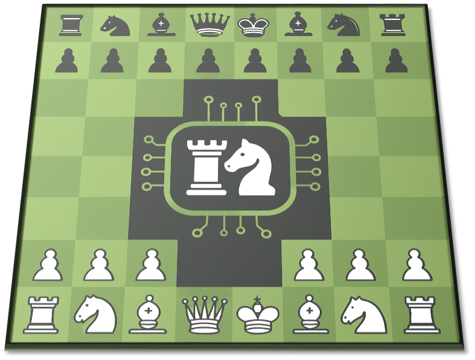
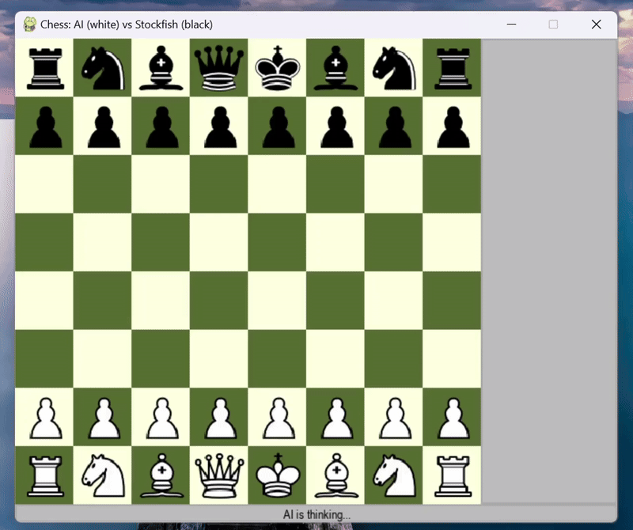
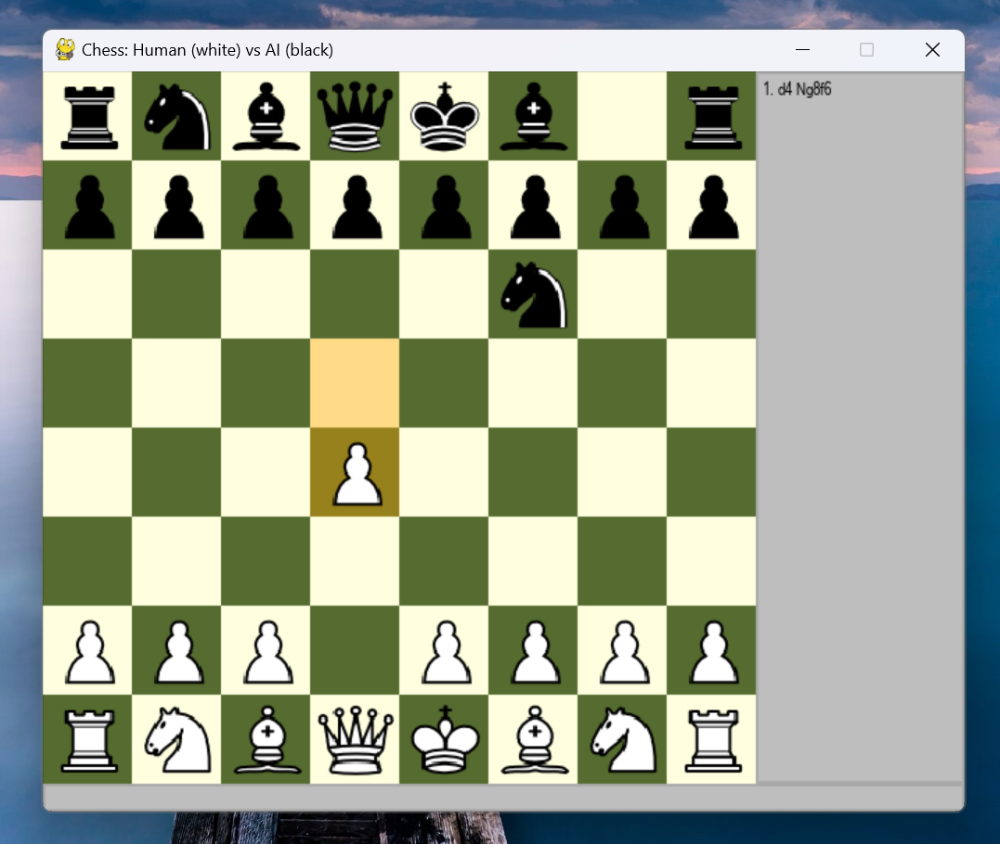
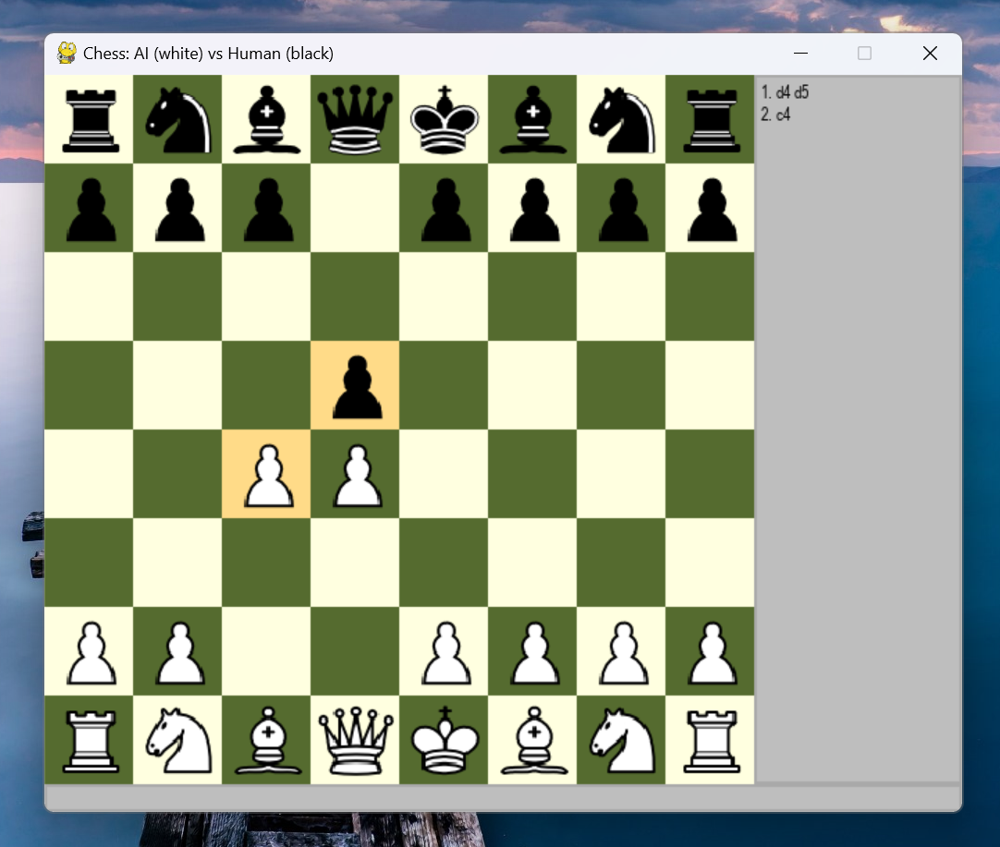
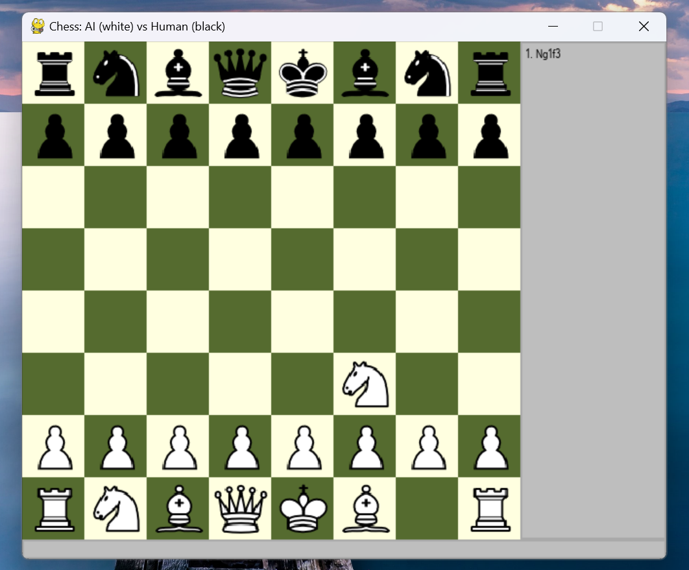
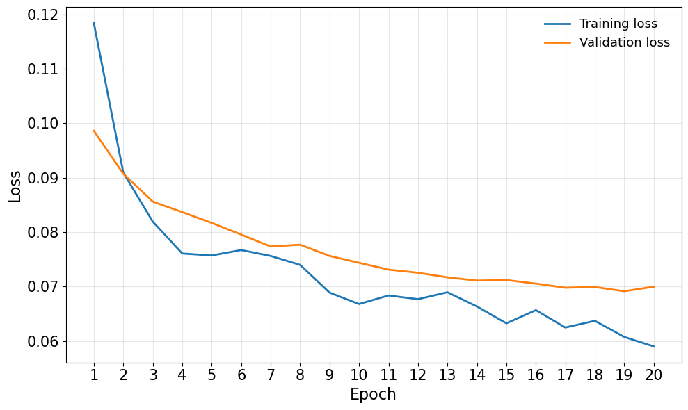
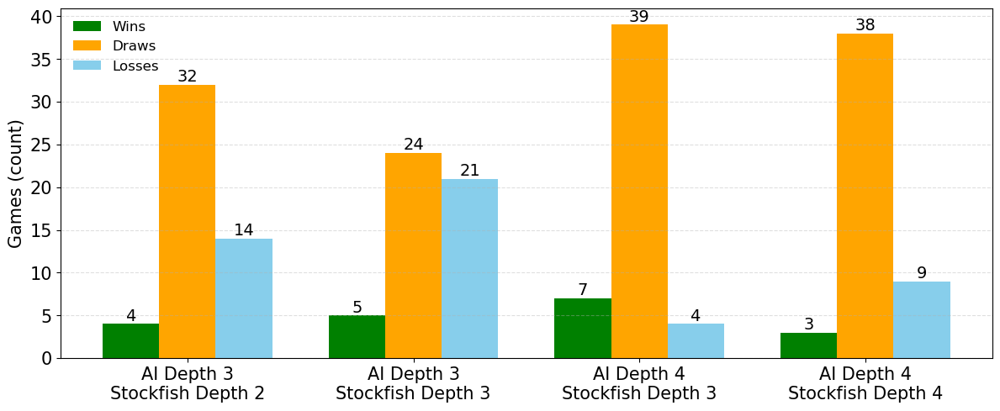
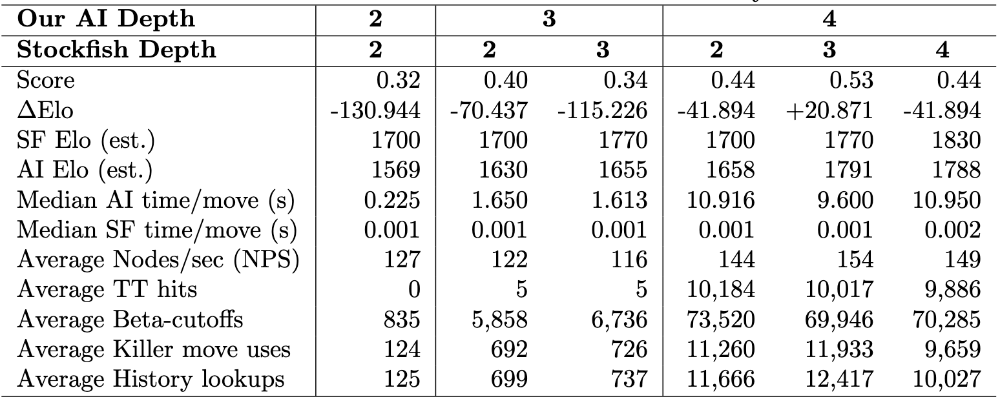

<p align="center">
  
</p>

<h1 align="center">Chess AI</h1>
<h2 align="center"> Negamax α–β Search with Incrementally Updatable DNN Evaluation</h2>

---

<p align="center">
  
  
  
  
  
  
  
  
  
  
  
  
</p> 
&#x20; &#x20;

<p align="justify">
This project implements a <b>hybrid</b> chess engine that integrates classical search techniques with a neural network–based evaluation function. The engine applies a <b>Negamax search with α–β pruning</b>, a standard approach in modern chess engines, to efficiently traverse the game tree. Board evaluation is performed by a <b>deep neural network (DNN)</b>, trained on encoded chess positions, which replaces traditional handcrafted evaluation rules. This combination allows the engine to capture tactical and positional patterns beyond those represented in simple numeric heuristics.
</p>

<p align="justify">
The system includes several supporting features: a transposition table to avoid redundant calculations, killer move and history heuristics to improve move ordering, and an opening book derived from Lichess data to strengthen early play. A Pygame-based graphical user interface (GUI) enables play in multiple configurations, including <b>Human vs AI, AI vs AI, and AI vs Stockfish</b>. Integration with the Stockfish engine provides a benchmark for performance comparisons. In fixed-depth arena matches, the engine achieved an estimated <b>Elo rating in the 1500–1800</b> range at depths 2–4.
</p>

<p align="justify">
Overall, the project demonstrates the integration of search, machine learning, and user interface design within a chess engine, highlighting both the potential and current limitations of Python-based AI systems.
</p>

---

## Table of Contents

- [Motivation](#motivation)
- [Highlights](#highlights)
- [Repository Layout](#repository-layout)
- [Setup](#setup)
  - [Windows](#windows)
  - [macOS](#macos)
  - [Run the UI](#run-the-ui)
  - [Quick Start Checklist](#quick-start-checklist)
- [Methodology](#methodology)
  - [Overview](#overview)  
  - [How the Engine Works](#how-the-engine-works)
    - [Game state & move generation](#game-state--move-generation)
    - [Search (Negamax + Alpha-Beta Pruning)](#search-negamax-ab-pruning)
    - [Evaluation (782‑dim features)](#evaluation-782dim-features)
    - [Incremental updates & batching](#incremental-updates--batching)
    - [Move ordering heuristics](#move-ordering-heuristics)
    - [Opening book](#opening-book)
    - [Stockfish integration](#stockfish-integration)
  - [Network Architecture & Training](#network-architecture--training)
  - [Prediction Speedups](#prediction-speedups)
  - [Feature Matrix (Quick Read)](#feature-matrix-quick-read)
- [Benchmarking Against Stockfish](#benchmarking-against-stockfish)
  - [Observations](#observations)
- [Advantages & Limitations](#advantages--limitations)
- [Ablations, Lessons Learned](#ablations-lessons-learned)
- [Troubleshooting](#troubleshooting)
- [Future Scope](#future-scope)
- [Poster](#poster)
- [License](#license)
- [References](#references)

---

## Motivation

The design of this engine is guided by two complementary inspirations in modern computer chess. The α–β search framework is motivated by Stockfish, which demonstrates the effectiveness of deep, optimized search with strong pruning techniques. For position evaluation, our approach draws inspiration from AlphaZero, which employs a full neural network model (in their case, a convolutional architecture). While we initially considered CNN-based evaluation, this was set aside due to practical constraints, and we instead adopted a fully connected DNN.

Implementing a full-model DNN in Python introduced its own efficiency challenges, particularly with inference speed during deep search. As a result, part of our motivation also shifted toward engineering improvements that reduce per-move computation time. The limitations of the initially considered CNN approach are discussed further in the Ablations section.

## Highlights

- **Negamax α–β** implementation with a lightweight **transposition table** and per‑search **stats**.
- **Neural evaluation** in TensorFlow/Keras using a **782‑dimensional** position encoding.
- **Incremental feature updates**: reuse parent features and update only what changed after a move.
- **Batch inference** with a cached prediction graph for minimal overhead inside the search loop.
- **Move ordering**: Transposition table (TT) move first, then captures, killer moves, and history‑boosted quiets.
- **Draw detection** implemented in the engine: threefold repetition, fifty‑move rule, insufficient material.
- **Pygame UI** to play Human/AI/Stockfish; **Stockfish** wired via `python-chess`.

---

## Repository Layout

```
project-ai-chess-engine/
├── chessAI.py                          # Search (negamax+αβ), TT, batching, heuristics, TF model IO
├── chessEngine.py                      # GameState, legal moves, repetition/fifty‑move/insufficient, FEN helpers
├── chessEncoding.py                    # 782‑dim input encoding + incremental update helpers (INPUT_DIM = 782)
├── chessOpening.py                     # OpeningBook using Lichess HF dataset; gzip+pkl cache
├── chessMain.py                        # Pygame UI and game loop (Human/AI/Stockfish; promotion & undo handlers)
├── stockfishHandler.py                 # OS‑aware launcher; move conversion via python‑chess
├── dnn_train/
│   └── ai_train.py                     # Training script (Dense MLP + Dropout; loss=mse, metric=mae)
│   └── launch_train_sagemaker.ipynb    # Training job launcher notebok
├── stats/                              # CSVs & notebooks with arena results, trained DNN metrics and summaries
│   ├── summary.csv, arena_results_*.csv, lichess_eval_model.csv, plots.ipynb
├── images_pieces/                      # Chess Piece images used by the UI
├── stockfish/                          # Stockfish executables (For Windows and Mac OS) 
│   └── stockfish-macos-m1-apple-silicon
│   └── stockfish-windows-x86-64-avx2.exe
├── arena.ipynb                         # Example notebook for running/evaluating matches
├── lichess_eval_model.keras            # Trained DNN Model (Keras) evaluator
├── assets/                             # README media assets 
├── Poster.pdf                          # Poster
└── LICENSE.md                          # MIT License
```

---

## Setup

###  

```bash
python -m venv chess_env
chess_env\Scripts\activate.bat    # For powershell -> chess_env\Scripts\activate.ps1
pip install --upgrade pip
pip install pygame python-chess numpy pandas tensorflow==2.19.0 tqdm matplotlib datasets
```

### 

```bash
python -m venv chess_env
source chess_env/bin/activate 
pip install --upgrade pip
pip install pygame python-chess numpy pandas tensorflow==2.19.0 tqdm matplotlib datasets
```

### Run the UI

```bash
python chessMain.py
```

In the Pygame start overlay, choose **White** and **Black** controllers (Human / AI / Stockfish) and their depths.

- **Move input**: click source → destination squares.  
- **Promotion**: ♕ <kbd>q</kbd> / ♖ <kbd>r</kbd> / ♗ <kbd>b</kbd> / ♘ <kbd>n</kbd>  
- **Undo**: ↩️ <kbd>z</kbd>  (reset: <kbd>r</kbd>)  

|  |  |
|:--:|:--:|
| *UI Startup* | *Human (white) vs Our AI (black)* |
|  |  |
|||
| *Our AI (white) vs Stockfish (black)* | *Human (white) vs Human (black)* |


### Quick Start Checklist
- **Stockfish binary**: Ensure the executable exists in `stockfish/` with the expected filename and execute permission.
- **TensorFlow compatibility:** Developed and tested on **TensorFlow 2.19.0**. Other versions may work, but are **not guaranteed**. Check your local version with:
  `python -c "import tensorflow as tf; print(tf.__version__)"`
- **Per-move time:** Hardware-dependent (CPU/GPU, drivers). If you experience lag, lower the search depth for smoother play.
- **First-run startup delay:** On first launch, the opening book is streamed and cached (from Lichess), which can add a short delay. Subsequent runs use the local cache and start quickly.

---

## Methodology

### Overview

Positions are encoded as a 782-D, white-perspective, NNUE-style feature vector and scored by a compact DNN. Search uses negamax + ${\alpha}-{\beta}$ pruning with per-parent minibatching at the leaf frontier (typically $\le$ 16 siblings in one NN call) to keep move ordering and pruning effective while reducing evaluator overhead. The engine is implemented in Python + TensorFlow and inference runs in float32 using a pre-compiled `tf.function` graph to minimize per-call Python/Keras overhead.

<p align="center">
  <br>
  <em>Full system pipeline, including data encoding, the network architecture, batched search, and
the training environment.</em>
</p>

### How the Engine Works

#### Game state & move generation

Defined in **[`chessEngine.py`](./chessEngine.py)**:

- `GameState` stores the board (8×8, two‑char piece codes like `wQ`, `bN`), side‑to‑move, castling rights, en‑passant, half‑move counter, and move log.
- Legal move generation per piece (`get_pawn_moves`, `get_rook_moves`, `get_knight_moves`, `get_bishop_moves`, `get_queen_moves`, `get_king_moves`) and castling helpers.
- **Draw conditions**: threefold repetition (via a repetition counter), fifty‑move rule, and insufficient material checks.
- Utility methods include FEN conversion (`to_fen`) for interoperability.

<a id="search-negamax-ab-pruning"></a>
#### Search (negamax + $\alpha\beta$ pruning)

Implemented in **[`chessAI.py`](./chessAI.py)**:

- Core search: `negamax_alpha_beta_search(...)` and `get_best_move(...)`.

- **Batched leaf evaluation (minibatch)**: At the frontier (`search_depth_left == 1`), we collect child positions, apply incremental encodings, and evaluate them in one NN call. a minibatch = 16 balances pruning and throughput—larger batches hurt move ordering, while size 1 underutilizes the NN.

- **Transposition table**: a Python dict keyed by FEN with flags `EXACT`, `LOWER`, `UPPER` to bound or commit scores; probes/hits/stores tracked in `SearchStats`.

- **Repetition & “Ping-Pong” handling:**
  - **Early draw detection:** Treat **threefold repetition**, **50-move rule**, and **insufficient material** as terminal draws early.
  - **Ping-pong penalty:** Only for roughly draw-ish spots (**`|score| ≤ DRAWISH_EPSILON`**), penalize immediate **ABAB** position bounces (via `position_stack`) or **same-piece** back-and-forth (A->B then B->A with no capture/castling/promotion). Apply **`score -= PING_PONG_PENALTY`** at the frontier; if any penalty occurs at a node, avoid caching as `EXACT` (store as `LOWER`).
    
- `SearchStats` class collects: `nodes`, `tt_probes`, `tt_hits`, `tt_stores`, `beta_cutoffs`, `first_move_cutoffs`, and killer/history usage counters.

#### Evaluation (782‑dim features)

- **[`chessEncoding.py`](./chessEncoding.py)** defines `INPUT_DIM = 782` (768 piece planes + 14 auxiliary features such as side‑to‑move, castling rights, en‑passant file, half‑move clock).
- **`run_ai_loop()`** in [`chessAI.py`](./chessAI.py) forwards batched encodings to TensorFlow; the **first call** creates a cached prediction graph; later calls reuse it.
- The Keras model path is referenced in code as `MODEL_PATH` (default points to `lichess_eval_model.keras`).

#### Incremental updates & batching

- Instead of recomputing the full vector, child positions reuse the parent vector and toggle only changed indices (move, capture, castling, promotion, en‑passant, etc.).
- Leaf positions are accumulated and **evaluated in batches** (`MAX_LEAF_BATCH`) to amortize framework overhead.

#### Move ordering heuristics

- **Ordered by Score (Descending): Pawn Promotion -> Capture -> Killer Move -> `HISTORY[move_id]` (for quiet moves).**
- History is awarded when a non-capture causes a $\beta$-cutoff at remaining depth `d` via `HISTORY[move_id] += d*d`. History accumulates within the same root search and resets each root so that captures don’t receive history.
- This increases $\beta$-cutoff and reduces nodes searched.

#### Opening book

- `OpeningBook` class from [`chessOpening.py`](./chessOpening.py) builds a simple opening book from the **[Lichess openings dataset](https://huggingface.co/datasets/Lichess/chess-openings)** (via `datasets.load_dataset`).
- A compressed pickle cache (e.g., `opening_moveCache.pkl.gz`) is created for faster subsequent runs.
- The AI imports and samples from this book in early plies when available.

|  |  |  |
|:--:|:--:|:--:|
| *Indian Defense* | *Queens Gambit* | *Zukertort Opening* |

#### Stockfish integration

- Launches Stockfish with OS‑specific defaults **from the `stockfish/` folder**:
  - Windows: `stockfish/stockfish-windows-x86-64-avx2.exe`
  - macOS (Apple Silicon): `stockfish/stockfish-macos-m1-apple-silicon`
- If the exact file is not executable, it falls back to `shutil.which("stockfish")`.
- Moves are converted between `python-chess` and the engine’s internal `Move` format.

---

###  Network Architecture & Training

[`ai_train.py`](dnn_train/ai_train.py) (TensorFlow/Keras):

| Section | Details |
|---|---|
| **Task/target** | Regression to scaled centipawns in **[−1, 1]** |
| **Model (DNN)** | `Dense(512, relu)` → `Dropout(0.2)` → `Dense(256, relu)` → `Dropout(0.2)` → `Dense(128, relu)` → `Dropout(0.2)` → `Dense(64, relu)` → `Dropout(0.2)` → `Dense(1, tanh)` |
| **Compile** | `loss="mse"`, `metrics=["mae"]` |
| **Optimizer** | Adam (`lr = 1e-4`) |
| **Data** | Streamed from [Lichess position evaluations](https://huggingface.co/datasets/Lichess/chess-position-evaluations) (384M rows); fixed validation set **N = 100k** |
| **Label scaling** | Clip cp to **±1000** → divide by **1000** → map to **[−1, 1]**; mates mapped to **±1** |
| **Schedule** | **Epochs:** 20 <br> **Steps/Epoch:** 2000 <br> **Batch Size:** 1024 <br> **Callbacks:** ReduceLROnPlateau, EarlyStopping, ModelCheckpoint |
| **Compute & launch (AWS SageMaker)** | **Instance:** NVIDIA T4 (16 GB) <br> **Launch notebook:** [`launch_train_sagemaker.ipynb`](dnn_train/launch_train_sagemaker.ipynb) <br> **Total positions seen:** `20 × 2000 × 1024 = 40,960,000` ≈ **40.9M** <br> **Training time:** ~12 hours |

- **Observation:** Training loss improves faster than validation (expected due to noisy/streamed positions). Slow MSE convergence for validation data.
- **Export**: Save the best model as `.keras` and place it at repo root (e.g., `lichess_eval_model.keras`).

<p align="center">
  <br>
  <em>Training vs validation loss (MSE) over 20 epochs.</em>
</p>

---

### Prediction Speedups

-  **Compiled prediction graph (`tf.function`):** We wrap the trained model once and make a warm-up call to build a cached graph. Subsequent inferences reuse the cached graph (minimal Python overhead) and were faster than `model.predict()` in our setup.
  
  ```python
  # chessAI.py
  @tf.function(jit_compile=False)
  def build_prediction_graph(model):
      def predict_fn(x):
          return model(x, training=False)  # disables Dropout, uses moving averages
      return predict_fn

  prediction_graph = build_prediction_graph(eval_model)
  _ = prediction_graph(MODEL_INPUT)  # warm-up to compile once
  # ... later:
  preds = prediction_graph(batch_np_float32)  # used instead of model.predict(...)
  ```
___

### Feature Matrix (Quick Read)

| Area | What we support | Notes |
|---|---|---|
| **Legality** | 100% legal move generation | Includes castling, en passant, promotion. |
| **Search** | Negamax + α–β pruning | - Depth override per request (`MAX_DEPTH`) <br> - Stats tracked in `SearchStats`. |
| **Batched eval** | Minibatched leaf evaluations | `MAX_LEAF_BATCH = 16` (frontier batching to amortize NN cost without hurting ordering). |
| **Caching** | Transposition table | - Keyed by FEN position <br> - Stores `{score, tt_depth, flag∈{EXACT, LOWER, UPPER}}` <br> - Depth-aware lookups tighten the ${\alpha}-{\beta}$ window or return exact scores. |
| **Move ordering** | Promotions, captures, killer moves, history |  Additive score: `+200` promo, `+100` capture, `+50` killer, `+HISTORY[move_id]` (quiet only) <br> - History update on β-cutoff: `HISTORY += d²`. |
| **Repetition handling** | Threefold, 50-move, insufficient material | - Early draw detection (treat as terminal) <br> - Ping-pong penalty: apply only when **`abs(score) ≤ DRAWISH_EPSILON = 0.15`** ; subtract **`PING_PONG_PENALTY = 0.02`** for immediate ABAB or same-piece back-and-forth (no capture/castle/promo). |
| **Evaluation** | Neural MLP on 782-D features | - White-centric output in **[−1, 1]** <br> - `WEIGHTS = {"dnn": 1.0}`; extensible (e.g., mobility, king safety). |
| **Terminal scoring** | Checkmate / stalemate anchors | `CHECKMATE_SCORE = 1000`, `STALEMATE_SCORE = 0`. |
| **Opening book** | Temperature-sampled, ≤20 plies | - Reduces early compute <br> - Adds randomnness (`temperature=0.75`, `max_book_plies=20`). |
| **UI/UX** | Pygame board & controls | - Dropdown player/depth, animations <br> - Human / AI / Stockfish combinations. |
| **Multiprocessing** | Separate AI process | - Loads model once <br> - Queues requests/replies to avoid per-move overhead. |
| **Model infrastructure** | TensorFlow `tf.function` prediction graph | - First call warms up/compiles <br> - Subsequent calls reuse cached graph (faster than `.predict()` in our setup). |

---

## Benchmarking Against Stockfish

<p align="center">
  <br>
  <em>Arena Outcomes vs Stockfish — 50 game simulations per depth combination, W–D–L.</em>
</p>

<p align="center">
  <br>
  <em>Fixed-depth arena matches vs Stockfish (50 games each). Time metrics are medians;
NPS/TT/β-cutoffs/killer/history are pooled averages. Positive ΔElo favors our AI. TT = transposition table.</em>
</p>

Detailed results and additional analyses are available in `arena_results_*.csv` files in the [`stats/`](stats/) directory. **Also in the CSVs (not shown in the summary table):**
  - `tt_probes`, `tt_hit_rate`, `tt_stores`: Detailed TT activity
  - `first_move_cutoffs`: $\beta$-cutoffs caused by the first tried move
  - `avg_branch`: Mean branching factor
  - `ai_nodes`, `ai_moves`: Nodes searched and AI moves per game
  - `game_wall_ms`: Total wall time per game
  - `did_castle`, `did_en_passant`, `did_promotion`: Special-move flags
  - `result`: Game outcome

### Observations

- **Perft validation:** Depth **1–5** passed; all generated moves were **legal**.
- **Special moves:** Engine correctly executed **pawn promotions**, **castling** (both sides), and **en passant**.
- **Draw detection:** Observed all standard draws in arena play:
  - **Threefold repetition** (most common),
  - **Insufficient material**,
  - **50-move rule**.
- **Per-move time vs depth:** Median AI time per move **increased with depth** due to exponential node growth, higher effective branching, and more NN leaf evaluations (mini-batching ≤16 mitigates but does not remove this).
- **Transposition table (TT) usage vs depth:** As the search depth increased, the transposition table demonstrated a **higher hit rate**, reflecting **greater reuse of previously explored positions**.
- **Move-ordering/pruning stats vs depth:** Average **$\beta$-cutoffs**, **killer move uses**, and **history lookups** **increased with depth**, indicating effective ordering and pruning as node counts grow.
- **Rough strength estimate:** Using Stockfish at depths **2/3/4** as ~**1700/1770/1830 Elo** baselines, our engine’s estimated Elo is **~1500–1800** at depths **2–4**.
> ***NOTE**: Stockfish's elo at various depths were roughly estimated by referring the following publication: [D. R. Ferreira, “The Impact of Search Depth on Chess Playing Strength” (PDF)](https://web.ist.utl.pt/diogo.ferreira/papers/ferreira13impact.pdf)*
---

## Advantages & Limitations

### Advantages
- **Rules-correctness:** Fully legal move generation with robust handling of castling, en passant, and promotions.
- **Neural evaluation gains:** Stronger than classical numeric heuristics at comparable depth.
- **Search efficiency:** ${\alpha}–{\beta}$ pruning + move ordering (promotions/captures/killers/history) + mini-batched leaf NN evaluation + transposition table.
- **Fast inference path:** Compiled `tf.function` graph + one-time model load via multiprocessing.
- **Resilience features:** Early draw detection and bias away from aimless repetition in near-equal positions.
- **Opening book:** Adds variety and reduces early compute.

### Limitations
- **Throughput vs C++ engines:** Python implementation (loops, interpreter) is slower, as effective depth scales with CPU/GPU and RAM.
- **Depth comparability:** Raw ply counts aren’t like-for-like vs. Stockfish. Compare configs (level/options) or time controls instead.
- **Startup cost:** Model load introduces latency (partly mitigated by warm-start/compiled graph).
- **Shallow search errors:** Occasional blunders at low depth remain.

---

## Ablations, Lessons Learned

What we tried, measured, and rolled back—brief reasons why.

- **Move caching (per-position):** Reduced repeated compute, but **startup/memory overhead** dominated in Python; net slowdown.
- **Null-move pruning:** Fewer recursive calls, yet **interpreter + function-call overhead** in Python outweighed gains as pruning effectiveness didn’t reduce overall runtime.
- **Quiescence search:** Conceptually sound (extend captures/tactics to reduce horizon effects), but in our pipeline **overhead > benefit**; NN leaf evaluation + move ordering was sufficient.
- **Extra hand-crafted terms (mobility, king safety) mixed into NN output:** Led to **double-counting** and unstable scales; simpler **NN-only score** proved more consistent.
- **Large NN batches:** Better throughput per call, but **hurt ${\alpha}–{\beta}$ move ordering** and delayed cutoffs; sweet spot remains **minibatch ≤ 16** at the frontier.
- **CNN evaluator (12×8×8 conv net):** Trained a small CNN, but **latency increased** with no clear accuracy gain at the same budget. On small batches, per-call overhead from **tensor conversion**, reshaping to (batch_size,12,8,8), host->device copy, and kernel launch dominates. The DNN delivered lower per-leaf latency.

---

## Future Scope

- **NNUE accumulator + INT8 head**: Skip the first layer calculation in neural network (Weights W1 * input x) and update it on each move; run the remaining layers in **INT8** big CPU speedups via SIMD (TFLite/ONNX), no retrain needed.
- **Iterative deepening with time controls**: Practical play (per-move/total clocks); industry norm.
- **Reinforcement learning**: useful but heavier infrastructure; add on top of supervised model.
- **Cython/C++ hotspots**: Port performance critical functions such as move-generation, make/undo, Transposition table probes, etc for further throughput.
- **Explore MCTS hybrid**: Prototype a policy/value Monte Carlo Tree Search (MCTS) variant (less classical than α–β) to compare strength vs compute trade-offs.

---

## Poster

The project poster provides a high-level overview — abstract, methodology, features, results, and future work.

**PDF:** [View the poster](Poster.pdf)

---
## License

This project is licensed under the MIT License. Please have a look at the [LICENSE](LICENSE) for more details.

---
## References

- [Eddie Sharick, “Creating a Chess Engine in Python” (YouTube playlist)](https://youtube.com/playlist?list=PLBwF487qi8MGU81nDGaeNE1EnNEPYWKY_)
- [Hugging Face, “Hugging Face — The AI community building the future.”](https://huggingface.co/)
- [Amazon Web Services, “Amazon SageMaker — Documentation.”](https://docs.aws.amazon.com/sagemaker/)
- [D. R. Ferreira, “The Impact of Search Depth on Chess Playing Strength” (PDF)](https://web.ist.utl.pt/diogo.ferreira/papers/ferreira13impact.pdf)
- [Stockfish Developers, “Stockfish” (GitHub repository)](https://github.com/official-stockfish/Stockfish)
- [Chessprogramming Wiki, “Chessprogramming.org.”](https://www.chessprogramming.org/)
- [Lichess, “Lichess.org”](https://lichess.org/)
